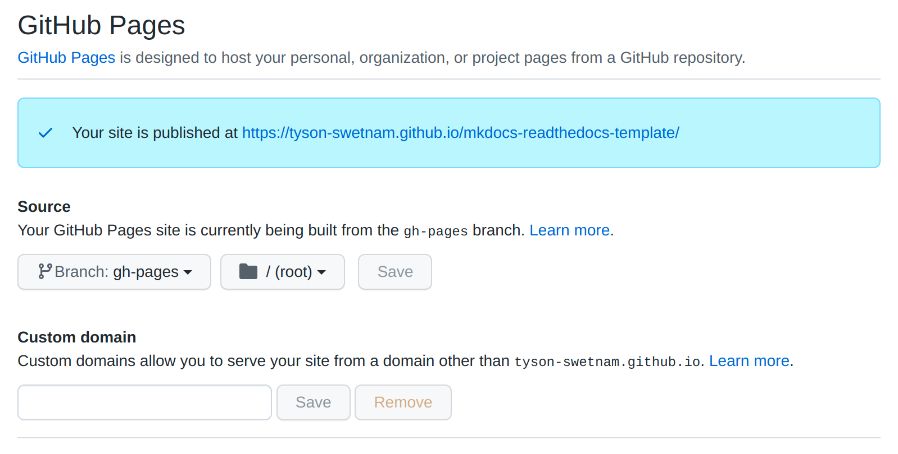

# Template CyVerse Manual Repo
**README Version 2.1, January 2022**

You should import this repo to build CyVerse Platform/Service Guides

**See what this template looks like [rendered as ReadTheDocs](https://cyverse-learning-materials.github.io/cyverse_manual_template)**
## How CyVerse Learning Center documentation is built

Each piece of CyVerse Learning Center has its own [ReadtheDocs](https://readthedocs.com/)
page which in turn is built from its own GitHub repo (see the template repos at [https://github.com/CyVerse-learning-materials](https://github.com/CyVerse-learning-materials)).

Starting from MkDocs and Mark Down syntax, we are rendering the web pages using GitHub Actions.

Finally, the site is added to CyVerse's [`https://learning.cyverse.org`](https://learning.cyverse.org) Domain Name Service (DNS). 

Directions for completing this workflow are below **(see Building Documentation from Scratch)**.

## Documentation types

- **Manuals -** A Manual is a more comprehensive documentation piece on a CyVerse
  platform or software product.
   - Written by: CyVerse Staff, with community contributions welcome
- **Platform Guide -** A Platform Guide is a slightly modified form of tutorial
  that covers an entire platform or service.
   - Written by: CyVerse Staff, with community contributions welcome
- **Quick Starts -** These materials are short tutorials that cover the minimal
  amount of information needed to complete an **operational task** (e.g.
  uploading data, reformatting a file, etc. ); there is no significant
  explanation of the science or interpretation of results. Quick Starts highlight
  available resources, answer common questions,
  and refer users to the most appropriate materials.
   - Written by: CyVerse Staff or community members
- **Tutorials -** Tutorials teach. Users should be able to follow an example
  dataset through the steps of a tutorial and gain understanding about what is
  happening along those steps. These are in-depth guides that usually address a
  scientific question by covering the major steps of a scientific workflow.
  A tutorial is ‘successful’ when a user is able to follow the tutorial a
  second time with their own data and obtain reasonable results.
  - Written by: CyVerse Staff or community members

**Examples of when to use what type of template:**

- Uploading a file: Quick Start
- Cleaning FastQ reads: Quick Start
- Basic introduction to an app: Quick Start
- Assembling a transcriptome using multiple apps and explaining the science: Tutorial
- An intro to the Discovery Environment: Platform Guide
- Comprehensive listing of all the basic functionalities of Discovery Environment: Manual

## What this repo contains

|Item|Description|Notes|
|----|-----------|-----|
|`docs/index.md`|This is the homepage of your documentation. It list the title and goal of the documentation, lists a maintainer, and usually indicates what prerequisite platforms, files, and services are needed to complete the tutorial||
|`docs/step1.md`|If documentation has more than one page, use this for the second and subsequent pages|Copy as needed for additional pages|
|`assets/`|Place images for your tutorials here|CyVerse logos and other useful images are already here|
|`docs/example_directives_delete.md`|Example page with code for common restructured text objects|**Delete** this page before publishing your materials|
|README.md|These instructions|**Delete** before publishing your documentation|
|`slides/`|Place slides associated with your tutorial here|Version controlled files preferred, PPT acceptable|
|`misc/`|Miscellaneous needed for building documentation| |
|`LICENSE`|License|This license file applies to all materials created by CyVerse for this documentation|

## Simple contribution instructions

### Reporting an error or issue via GitHub

- Click the 'issues' tab at the top of this GitHub page to let us know about a
  simple mistake such as a typo or missing file.

 OR

- Send an email to the maintainer  listed in the documentation or [Tutorials@CyVerse.org](mailto:tutorials@cyverse.org)

## More complex contributions

### Fixing and/or improving documentation via GitHub

1. [Fork](https://help.github.com/articles/fork-a-repo/) this repo to your
   GitHub account
2. Make desired edits. For very significant changes (we suggest
   [making a new branch](https://help.github.com/articles/creating-and-deleting-branches-within-your-repository/)).
3. Commit change; if working from a local copy, push those changes to your fork
   in Github.
4. Submit a pull request back to the master repository; you may need to act on
   feedback before your request is merged.


## Building Documentation from Scratch

**You will need the following**

1. [GitHub account](https://github.com/) - makes it possible to collaborate on the documentation.
2. (*Optional*) access to GitHub [CodeSpaces](https://github.com/codespaces) - to work in a VS Code development environment on the repository.

### Obtaining the template

1. Choose one of the template repositories at https://github.com/CyVerse-learning-materials/
   (these are pinned at the top of this page). Click the **Use this template**
   button. Name your repo for the name of your documentation e.g.
   *'name_tutorial'*. You may choose public or private. There is no need to
   include all branches (leave unchecked).

   - (*Optional*) Once you have a new repo made from the template, clone this new repo to your local machine for editing locally.

   - (*Optional*) Open the new repository in CodeSpaces and work in VS Code development environment. You must commit your changes back to GitHub.

### Authoring tools (on GitHub or CodeSpaces)

In order to build our documentation you can keep the repository in your personal GitHub user space and allow the `.github/workflows/main.yml` Action to render the pages using `gh-pages`

1. Clone the repository to your username space.

2. Click on `Settings` > `Pages` > `Source` in GitHub.
   - Under `Source` select the `Branch:gh-pages` and leave the file directory as `root`
   - Save and Exit



3. Check the GitHub Action
   - in the `.github/workflows/` folder there is a `main.yml`
   - We are using a basic action from user [mhausenblas/mkdocs-deploy-gh-pages](https://github.com/mhausenblas/mkdocs-deploy-gh-pages) which renders the ReadTheDocs theme for MkDocs using the `@nomaterial` branch.

      ```
      name: Publish docs via GitHub Pages
      on:
      push:
         branches:
            - main

      jobs:
      build:
         name: Deploy docs
         runs-on: ubuntu-latest
         steps:
            - name: Checkout main
            uses: actions/checkout@v1

            - name: Deploy docs
            uses: mhausenblas/mkdocs-deploy-gh-pages@nomaterial
            env:
               GITHUB_TOKEN: ${{ secrets.GITHUB_TOKEN }}
      ```

4. Edit the [`mkdocs.yml`](mkdocs.yml) metadata to match your new repository.
   - On the first few lines you will need to update the `repo_name:` to use your GitHub username and new repository name, the `repo_url:` to use your `github.io` page or other DNS. Do not change the `docs_dir:` unless you plan to move the `.md` files.

   ```
   docs_dir: docs/
   repo_name: 'cyverse-learning-materials/cyverse-manual-template-mkdocs'
   repo_url: 'https://github.com/cyverse-learning-materials/cyverse-manual-template'
   ```
   - You also need to update the `site_name:`, `site_description:`, `site_author:`, and `site_url:` to match your new repository
   
   ```
   site_name: 'CyVerse Learning Center'
   site_description: 'Documentation for CyVerse Platforms and Education'
   site_author: 'CyVerse Science Team'
   site_url: https://cyverse-learning-materials.github.io/cyverse-manual-template/
   ```

   ---
   **NOTE**

   [MkDocs-Material](https://squidfunk.github.io/mkdocs-material/) theme uses the `@master` branch of this Action. To render as the MkDocs-Material theme:
   - change [`./github/workflows/main.yml`](.github/workflows/main.yml) to use `@material` branch
   - change the [`mkdocs.yml`](mkdocs.yml) to use `theme: material`   
   ---

5. Update the Navigation Bar in the [`mkdocs.yml`](mkdocs.yml)
   - The markdown pages in the `docs/` folder are rendered in the table of contents given their hierarchy in the `nav:` with the left side set as the description.

   ```
   # Navigation Page
   nav:
   - Home: index.md
   - step1: step1.md
   - step2: step2.md
   - FAQ: faq.md
   ```

### Editing the template

1. Edit the [`index.md`](docs/index.md) and other files as needed. Save images or other files in the appropriate directories. **See the recommended style guide in the template.**

2. Since tutorials will likely span multiple pages, you can copy internal pages page as many times as needed. Update the table of contents at the top of the 'index.md' accordingly. We will have **only documentation piece per repo.**

3. Save your work such as:
    - individual pages (e.g. `index.md`, `step2.md`, etc.)
    - images (as `.png` files in the  the `/assets` folder)

4. Commit your changes and push the tutorial back to GitHub.

5. The tutorial will build automatically with the Action and will be visible on your webpage `https://your_username.github.io/template_mkdocs_repo/`  


## Wrapping up and hosting documentation in the Learning Center

Once you have built your documentation, notify
[Tutorials@CyVerse.org](mailto:Tutorials@CyVerse.org) that your tutorial is
ready for inclusion in the main CyVerse documentation repo. We will review and
verify the contribution, and add you as a maintainer repo in the CyVerse
collection. Alternatively, you can host your tutorial independently on
ReadTheDocs following their
[instructions for importing documentation](https://docs.readthedocs.io/en/latest/getting_started.html#import-your-docs). We will also follow up about ensuring test data associated with the
documentation are available and open.

### Documentation Style Guide

*General Principles*

- Write instructions in short numbered steps
- Where possible limit step to one action; small final actions such as
  'press submit' should be separated by a semicolon
- Limit the use of screenshots; where they are needed, use ReStructured text
  directives for [substitution of images](http://docutils.sourceforge.net/docs/ref/rst/restructuredtext.html#substitution-definitions)
- Use the *'raw ::html'* directive to enter hyperlinks so that they will open
  in a new tab. See each repo for an example of the code
- Example data associated with documentation should be anonymously available on
  CyVerse Data Commons (Tutorials@cyverse.org can help you with this)
- Discovery Environment applications should be directly linked to documentation
  (clicking the 'info' button on any application will give you the 'App URL')
- Atmosphere images should be directly linked to documentation
  (e.g. "atmo.cyverse.org/application/images/####"

*Specific examples*

|Instruction|Example|
|-----------|-------|
|Steps generally begin with a verb or preposition|<ul><li>Click on the button<li>Under the "Result" menu</ul>|
|Locations of files are given in absolute paths|<ul><li>/dir1/dir2/file.extension</ul>|
|Top-level menus in Discovery Environment Apps in double quotes|<ul><li>Under "Input" select...</ul>|
|Subheadings/steps in Discovery Environment Apps in single quotes|<ul><li>For 'sensitivity' enter...</ul>|
|Buttons and keywords in bold|<ul><li>Click on **Apps**<li>Select **Arabidopsis**<li>Set 'sensitivity' to **Medium**</ul>|

## Sample and test data for Learning Center materials

**ALL** materials with sample or test data on the Learning Center should be  
available with anonymous/public read access at /iplant/home/shared/cyverse_training

````
/iplant/home/shared/cyverse_training:
  C- /iplant/home/shared/cyverse_training/classrooms
  C- /iplant/home/shared/cyverse_training/cyverse_austria_training
  C- /iplant/home/shared/cyverse_training/datasets
  C- /iplant/home/shared/cyverse_training/example
  C- /iplant/home/shared/cyverse_training/manuals
  C- /iplant/home/shared/cyverse_training/platform_guides
  C- /iplant/home/shared/cyverse_training/quickstarts
  C- /iplant/home/shared/cyverse_training/tutorials
  C- /iplant/home/shared/cyverse_training/workshop_materials
````

In general, data should be in the appropriate `manuals`,`platform_guides`,
`quickstarts`, `tutorials`, or `workshop_materials` folders. 
